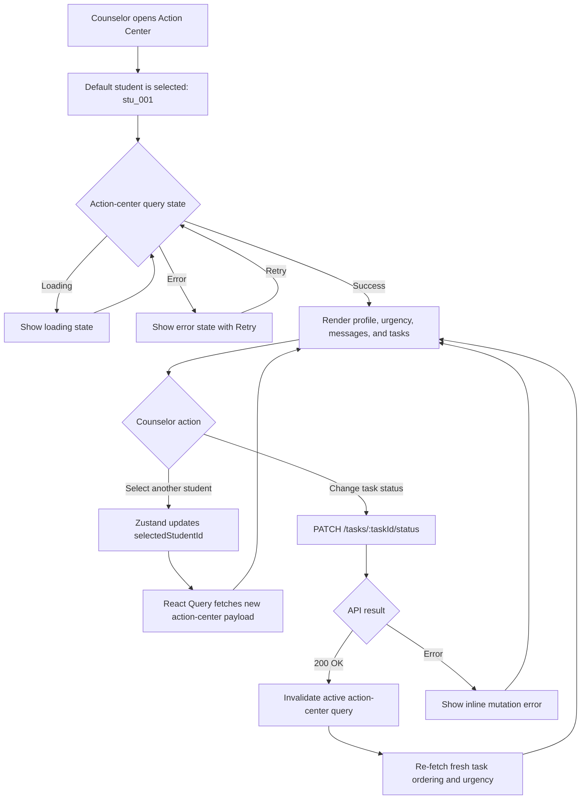
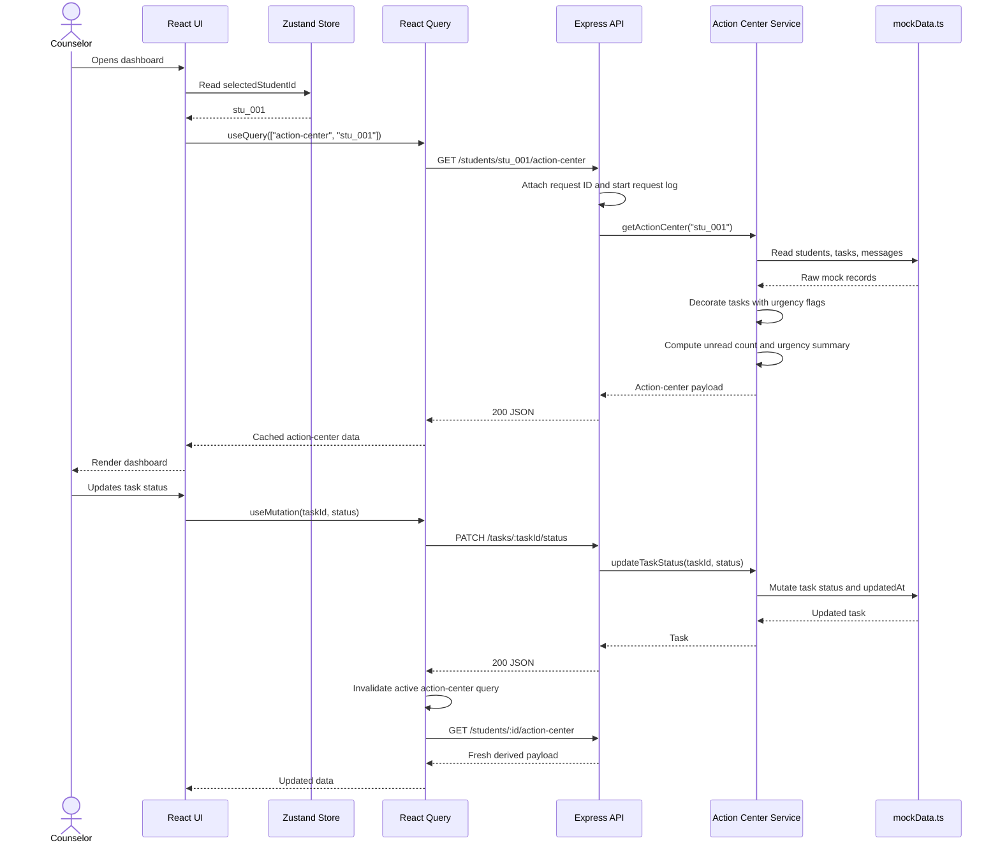
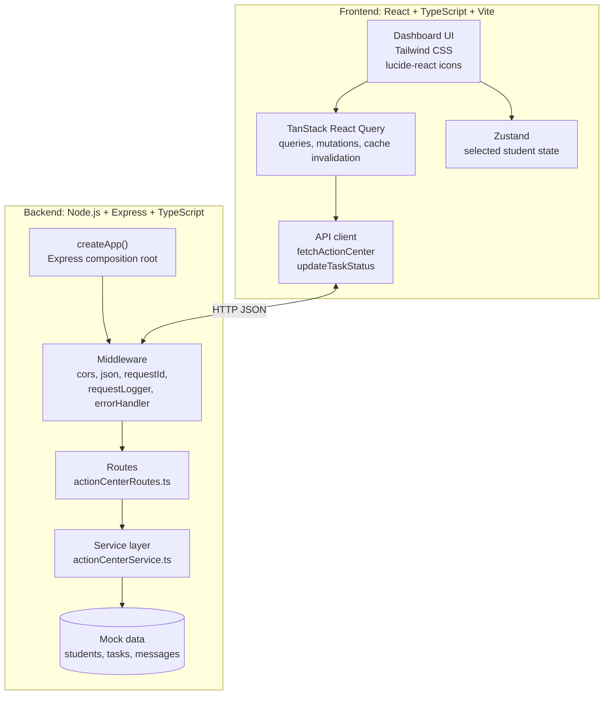
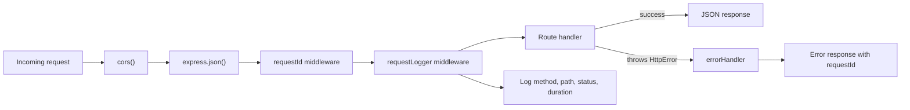
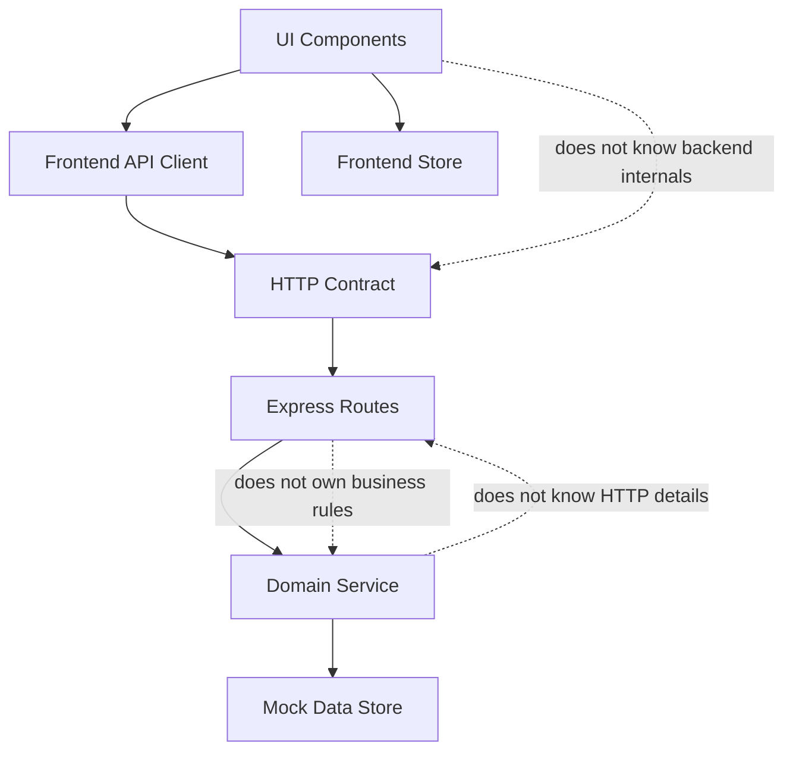

# Zyra Counselor Student Action Center

A full-stack assessment feature for counselors to quickly understand a student's profile, open tasks, unread messages, and urgency level. The project is structured as a small production-minded monorepo with a React/Vite frontend and an Express/TypeScript backend.


## Table Of Contents

- [Overview](#overview)
- [Quick Start](#quick-start)
- [Run Commands](#run-commands)
- [User Flow](#user-flow)
- [Data Flow](#data-flow)
- [Architecture](#architecture)
- [Project Structure](#project-structure)
- [API Contract](#api-contract)
- [Production Readiness](#production-readiness)
- [Performance Decisions And Tradeoffs](#performance-decisions-and-tradeoffs)
- [Testing](#testing)
- [Tech Stack](#tech-stack)

## Overview

The Counselor Student Action Center helps a counselor answer four questions quickly:

- Who is the selected student?
- What tasks require action?
- How many messages are unread?
- How urgent is this student's current situation?

The backend owns the mock data and derives the action-center payload. The frontend uses TanStack React Query for server state, Zustand for selected-student UI state, and Tailwind CSS for a professional SaaS-style dashboard.

## Quick Start

### Prerequisites

| Tool | Recommended |
| --- | --- |
| Node.js | 18 or newer |
| npm | 9 or newer |

### Install

```bash
npm install
```

### Start Both Apps

```bash
npm run dev
```

| Service | URL |
| --- | --- |
| Backend API | `http://localhost:5000` |
| Frontend | `http://127.0.0.1:5173` |

## Run Commands

```bash
# Start backend and frontend together
npm run dev

# Start backend only
npm run dev:backend

# Start frontend only
npm run dev:frontend

# Run all tests
npm test

# Run backend tests only
npm test -w backend

# Run frontend tests only
npm test -w frontend

# Build backend and frontend
npm run build
```

The compiled backend is emitted to `backend/dist/`. The compiled frontend is emitted to `frontend/dist/`.

## User Flow



## Data Flow



## Architecture

### System Architecture



### Backend Request Pipeline



### Clean Architecture Boundaries



## Project Structure

```text
zyra-action-center/
  backend/
    src/
      data/
        mockData.ts              # Exact assessment mock data
      middleware/
        errorHandler.ts          # Structured error responses
        requestId.ts             # Request ID propagation/generation
        requestLogger.ts         # JSON request logs
      routes/
        actionCenterRoutes.ts    # API endpoints
      services/
        actionCenterService.ts   # Urgency, sorting, task updates
      tests/
        actionCenter.test.ts     # Backend integration tests
      app.ts                     # Express app factory
      errors.ts                  # HttpError
      server.ts                  # Runtime entry point
      types.ts                   # Backend domain types
    package.json
    tsconfig.json

  frontend/
    src/
      api/
        actionCenterApi.ts       # Fetch client and response parsing
      store/
        useStudentStore.ts       # Zustand selected student state
      tests/
        App.test.tsx             # Frontend render/mutation test
      App.tsx                    # Dashboard UI
      main.tsx                   # React root and QueryClient
      styles.css                 # Tailwind layers
      types.ts                   # Frontend response types
      vite-env.d.ts              # Vite env types
    postcss.config.js
    tailwind.config.js
    package.json
    tsconfig.json

  docs/
    test-output.svg              # Test output screenshot-style artifact

  package.json                   # npm workspace scripts
  README.md
```

## API Contract

### `GET /health`

Returns API health.

```json
{
  "ok": true
}
```

### `GET /students/:id/action-center`

Returns the selected student's profile, tasks, unread message count, recent messages, and computed urgency summary.

#### Path Parameters

| Name | Type | Example |
| --- | --- | --- |
| `id` | string | `stu_001` |

#### Success Response

Status: `200 OK`

```json
{
  "student": {
    "id": "stu_001",
    "name": "Maya Patel",
    "email": "maya.patel@school.edu",
    "grade": 11,
    "gpa": 3.2,
    "counselorId": "csl_001",
    "enrollmentStatus": "at_risk"
  },
  "tasks": [
    {
      "id": "tsk_003",
      "studentId": "stu_001",
      "title": "Attendance improvement plan",
      "description": "Student missed 8 days this semester. Plan must be signed.",
      "status": "todo",
      "priority": "urgent",
      "dueDate": "2026-05-28",
      "createdAt": "2026-05-15T11:00:00Z",
      "updatedAt": "2026-05-15T11:00:00Z",
      "isOverdue": true,
      "isDueSoon": false,
      "urgencyLabel": "Urgent"
    }
  ],
  "unreadMessagesCount": 2,
  "recentMessages": [
    {
      "id": "msg_001",
      "studentId": "stu_001",
      "from": "Mrs. Thompson (Math)",
      "subject": "Maya missing assignments",
      "preview": "Maya has not submitted the last three homework sets...",
      "read": false,
      "receivedAt": "2026-05-30T08:30:00Z"
    }
  ],
  "urgency": {
    "level": "critical",
    "label": "Critical",
    "reasons": [
      "2 urgent open tasks",
      "1 overdue task",
      "2 unread messages"
    ]
  }
}
```

#### Derived Task Fields

| Field | Meaning |
| --- | --- |
| `isOverdue` | Task is not completed and due date is before June 4, 2026 |
| `isDueSoon` | Task is not completed and due within 3 days |
| `urgencyLabel` | UI-friendly label derived from task priority and due-date state |

#### Urgency Rules

| Level | Label | Rule |
| --- | --- | --- |
| `critical` | `Critical` | At least one urgent open task or overdue task |
| `high` | `High Priority` | At least one high-priority open task or task due within 3 days |
| `medium` | `Moderate` | Open tasks or unread messages exist |
| `low` | `On Track` | No open tasks and no unread messages |

#### Error Response

Status: `404 Not Found`

```json
{
  "error": {
    "message": "Student not found",
    "requestId": "a4fd8ef9-2c8d-4f23-a6e2-5de1a0d4a121"
  }
}
```

### `PATCH /tasks/:taskId/status`

Updates a task status in the backend in-memory data store.

#### Path Parameters

| Name | Type | Example |
| --- | --- | --- |
| `taskId` | string | `tsk_001` |

#### Request Body

```json
{
  "status": "completed"
}
```

Allowed values:

- `todo`
- `in_progress`
- `completed`

#### Success Response

Status: `200 OK`

```json
{
  "task": {
    "id": "tsk_001",
    "studentId": "stu_001",
    "title": "Submit FAFSA application",
    "description": "Deadline is approaching. Student has not started the form.",
    "status": "completed",
    "priority": "urgent",
    "dueDate": "2026-06-05",
    "createdAt": "2026-05-13T14:00:00Z",
    "updatedAt": "2026-06-04T11:42:30.000Z"
  }
}
```

#### Error Responses

Invalid status:

```json
{
  "error": {
    "message": "Status must be one of: todo, in_progress, completed",
    "requestId": "test-request-id"
  }
}
```

Task not found:

```json
{
  "error": {
    "message": "Task not found",
    "requestId": "a4fd8ef9-2c8d-4f23-a6e2-5de1a0d4a121"
  }
}
```

## Production Readiness

### Backend Request Logging

Implemented in `backend/src/middleware/requestLogger.ts`.

Each request logs a structured JSON line when the response finishes:

```json
{
  "requestId": "3d9bfe6b-480b-4099-9072-be33dbd6301c",
  "method": "GET",
  "path": "/students/stu_001/action-center",
  "statusCode": 200,
  "durationMs": 17
}
```

Why this matters:

- Logs are machine-readable.
- Duration is measured for every route.
- `requestId` allows a failing user report to be matched with a server log.

### Error Middleware With Request IDs

Implemented in:

- `backend/src/middleware/requestId.ts`
- `backend/src/middleware/errorHandler.ts`
- `backend/src/errors.ts`

Behavior:

- If the client sends `x-request-id`, the backend uses it.
- If no ID is provided, the backend generates one with `crypto.randomUUID()`.
- The response header includes `x-request-id`.
- Error responses include `error.requestId`.
- Non-`HttpError` failures become `500 Internal server error`.

### Integration And Frontend Tests

Backend:

- Uses `supertest` against the real Express app.
- Covers full request pipeline, action-center derivation, task mutation, and request-ID error behavior.

Frontend:

- Uses React Testing Library with a stubbed `fetch`.
- Covers full app render and task status mutation request shape.

## Performance Decisions And Tradeoffs

### React Query For Server State

The frontend stores API results in TanStack React Query instead of local component state.

Benefits:

- Caches each student by `["action-center", studentId]`.
- Avoids duplicate fetch logic.
- Gives built-in loading and error states.
- Supports mutation invalidation after task status updates.

Tradeoff:

- After a task status update, the app re-fetches the action-center payload instead of locally patching the task. This costs one extra request, but it keeps urgency labels and task sorting aligned with backend logic.

### Zustand For Lightweight UI State

Only the selected student ID lives in Zustand.

Benefits:

- Keeps UI state separate from server state.
- Avoids prop drilling.
- Keeps the store tiny and easy to test mentally.

Tradeoff:

- This is intentionally not a full global app store. Larger features might add routing or URL state for deep links.

### Backend Service Layer

Business rules live in `actionCenterService.ts`, not in the Express route files.

Benefits:

- Routes stay thin.
- Urgency logic is easy to test and modify.
- Future MongoDB integration can replace the mock data access without rewriting HTTP handlers.

Tradeoff:

- The current service is synchronous because the data is in memory. A real database migration would make the service methods async.

### In-Memory Mock Data

The assessment requires exact mock data in the backend. The task update endpoint mutates the in-memory task array.

Benefits:

- No database setup required.
- Fast and deterministic.
- Easy for reviewers to run.

Tradeoff:

- Data resets on server restart.
- Not safe for multi-process production deployments.
- A production version would persist tasks in MongoDB and likely publish task/message changes over SSE or WebSockets.

### Tailwind CSS For UI Performance

The frontend uses Tailwind utility classes.

Benefits:

- Small generated CSS bundle.
- No runtime styling library.
- Easy to keep SaaS dashboard spacing, borders, badges, and state colors consistent.

Tradeoff:

- JSX has longer class strings. This is acceptable here because the app is small and the visual system is simple.

### No Optimistic Update

The task select waits for the server response and then invalidates the query.

Benefits:

- Avoids duplicating urgency and sorting rules on the client.
- Prevents the UI from briefly showing a wrong task order.

Tradeoff:

- There is a small perceived delay during mutation. The select is disabled while the mutation is pending to avoid double submits.

## Testing

Run all tests:

```bash
npm test
```

Expected summary:

```text
Backend: 1 test file, 3 tests passed
Frontend: 1 test file, 1 test passed

Both test suites passing. Here's your complete reference:

Commands and file locations
Run backend tests

cd backend
npm test
Expected: 3 passed in ~2-3s

Run frontend tests

cd frontend
npm test
Expected: 1 passed in ~7s

Run both from the root

npm test --workspaces
What each file does
File	What it tests / does
backend/src/tests/actionCenter.test.ts	3 integration tests — hits the real Express app via supertest: (1) GET returns correct student/urgency/tasks, (2) PATCH updates a task status, (3) invalid status returns 400 with requestId in the error body
backend/src/middleware/requestId.ts	Honours incoming x-request-id header, or generates a UUID; attaches to req.requestId and echoes it back in response headers
backend/src/middleware/requestLogger.ts	Logs JSON {requestId, method, path, statusCode, durationMs} on every response finish
backend/src/middleware/errorHandler.ts	Catches errors, returns {error: {message, requestId}} with correct HTTP status
frontend/src/tests/App.test.tsx	1 integration test — stubs fetch, renders the full App, checks data renders, then interacts with the shadcn/Radix Select to change a task status and asserts the PATCH call fires correctly
```

### Test Output Screenshot

The repository includes a screenshot-style test output artifact:


### Backend Test Cases

| Test | Purpose |
| --- | --- |
| Returns action center | Verifies student profile, unread count, critical urgency, and overdue task decoration |
| Updates task status | Verifies `PATCH /tasks/:taskId/status` changes a task to `completed` |
| Returns request IDs from error middleware | Verifies invalid status returns `400` with caller-provided `x-request-id` |

### Frontend Test Case

| Test | Purpose |
| --- | --- |
| Renders action center data and updates task status | Verifies the dashboard renders API data and sends the correct PATCH request when status changes |

## Tech Stack

### Backend

| Technology | Purpose |
| --- | --- |
| Node.js | Runtime |
| Express | HTTP server and routing |
| TypeScript | Type safety |
| Supertest | Backend integration testing |
| Vitest | Test runner |

### Frontend

| Technology | Purpose |
| --- | --- |
| React | UI framework |
| TypeScript | Type safety |
| Vite | Dev server and bundler |
| Tailwind CSS | SaaS-style utility-first UI |
| TanStack React Query | Server state and mutations |
| Zustand | Selected student client state |
| lucide-react | Icons |
| React Testing Library | Frontend integration test |
| Vitest | Test runner |

## Short Architecture Note

The project is split into `backend` and `frontend` workspaces so each side has its own dependencies, TypeScript configuration, scripts, and tests. The backend exposes a small REST API, keeps the exact mock data in `mockData.ts`, and centralizes business rules in a service layer. The frontend treats the backend as the source of truth, uses React Query for API cache/mutations, and keeps only selected-student UI state in Zustand. This keeps the feature easy to run, review, test, and later migrate from mock data to MongoDB.
